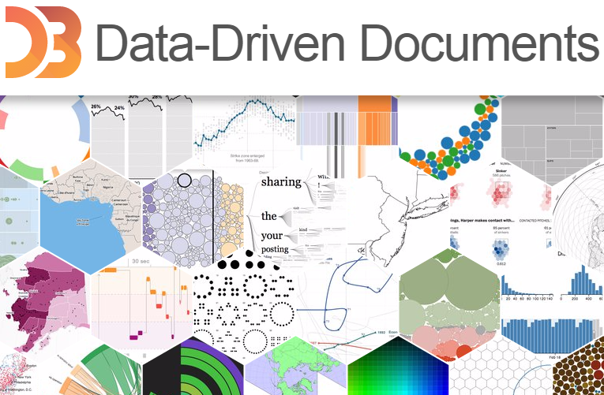

D3.js Playbook
==============

Written by [Pratap Vardhan](https://twitter.com/PratapVardhan)

This playbook is a reciped-based introduction for building web-based interactive data visulizations using [D3.js](http://d3js.org/). It also provides a number of recipes with sample codes to help you get started quickly.

[D3.js](http://d3js.org/) is a JavaScript library for manipulating documents based on data. D3 helps you bring data to life using HTML, SVG, and CSS.
