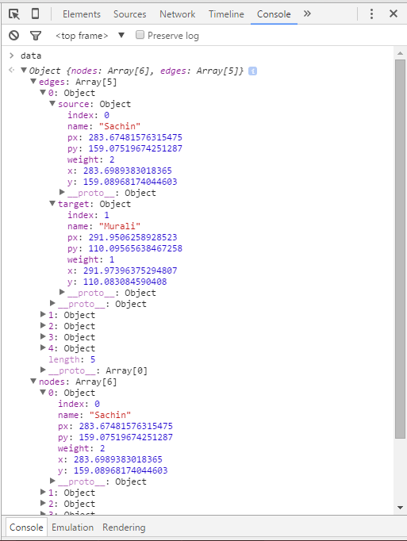

# Force Layout

Force-directed Layout assign forces among the set of edges and the set of nodes for drawing graphs in an aesthetically pleasing way. Nodes (entities) are represented as circles, and edges (connections) as lines.


Now, consider a sample cricket data, with nodes as player names. And, edges as relationship/connection between these players.

```javascript
// data
var data = {
  nodes: [
    {name: "Sachin"},
    {name: "Murali"},
    {name: "Glenn McGrath"},
    {name: "AB de Villiers"},
    {name: "Akram"},
    {name: "BCCI"}
  ],
  edges: [
    {source: 0, target: 1},
    {source: 0, target: 2},
    {source: 2, target: 3},
    {source: 2, target: 4},
    {source: 3, target: 4}
  ]
}
```

The edges contain two values - {source, target}. These values correspond to the nodes above, so source=0 is Sachin, for example. `{source: 0, target: 1}` means Sachin is connected to Murali.

## Apply Force

```javascript
// init a force layout, using the nodes and edges in dataset
var force = d3.layout.force()
           .nodes(data.nodes)
           .links(data.edges)
           .size([width, height])
           .linkDistance([50])
           .charge([-100])
           .start()
// define 10 random colors
var colors = d3.scale.category10()
// create SVG
var svg = d3.select("body")
      .append("svg")
      .attr("width", width)
      .attr("height", height)
// create edges
var edges = svg.selectAll("line")
  .data(data.edges)
  .enter()
  .append("line")
  .style("stroke", "#ccc")
  .style("stroke-width", 2)
// create nodes
var nodes = svg.selectAll("circle")
  .data(data.nodes)
  .enter()
  .append("circle")
  .attr("r", 6)
  .style("fill", function(d, i) { return colors(i) })
  .call(force.drag)
// On every tick" event, re-render
force.on("tick", function() {
  edges.attr("x1", function(d) { return d.source.x })
       .attr("y1", function(d) { return d.source.y })
       .attr("x2", function(d) { return d.target.x })
       .attr("y2", function(d) { return d.target.y })

  nodes.attr("cx", function(d) { return d.x })
       .attr("cy", function(d) { return d.y })
})
```
<iframe src="../recipes/layout-force.html" sandbox="allow-same-origin allow-scripts" onload="this.style.height=this.contentDocument.documentElement.scrollHeight+2+'px';"></iframe>

## __data__

Let's look at the console to observer changes in data


