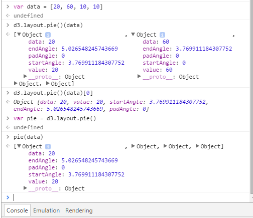

# Pie Layout

`d3.layout.pie()` takes data and generates array of objects.

```javascript
var data = [20, 60, 10, 10]
d3.layout.pie()(data)
d3.layout.pie()(data)[0]

var pie = d3.layout.pie()
pie(data)
```
Each of the objects returns data, value, **startAngle** and **endAngle**.



## Construct Pie
```javascript
//Width and height
var data = [20, 60, 10, 10]
var width = 250
var height = 250
var outerRadius = width/2
var innerRadius = 0
//Create SVG element
var svg = d3.select("body")
      .append("svg")
      .attr("width", width)
      .attr("height", height)
// pie layout function
var pie = d3.layout.pie()
var piedata = pie(data)
//Set up pie groups
var arcs = svg.selectAll("g")
        .data(piedata)
        .enter()
        .append("g")
        .attr("transform", "translate(" + outerRadius + "," + outerRadius + ")")
// Create arc function with parameters
var arc = d3.svg.arc()
        .innerRadius(innerRadius)
        .outerRadius(outerRadius)
// Draw arc paths
arcs.append("path")
    .attr("d", arc)
```
<iframe src="../recipes/layout-pie.html" sandbox="allow-same-origin allow-scripts" onload="this.style.height=this.contentDocument.documentElement.scrollHeight+2+'px';"></iframe>

## Fill Color
```javascript
// Create ordinal scale color palette
var color = d3.scale.category10();
// Draw arc paths
arcs.append("path")
    .attr("d", arc)
    .attr("fill", function(d, i) { return color(i) }) // Fill color
```
<iframe src="../recipes/layout-pie-color.html" sandbox="allow-same-origin allow-scripts" onload="this.style.height=this.contentDocument.documentElement.scrollHeight+2+'px';"></iframe>

## Add Labels
```javascript
// Labels
arcs.append("text")
    .attr("transform", function(d) {
      return "translate(" + arc.centroid(d) + ")"
    })
    .attr("text-anchor", "end")
    .text(function(d) {return d.value})
```
<iframe src="../recipes/layout-pie-labels.html" sandbox="allow-same-origin allow-scripts" onload="this.style.height=this.contentDocument.documentElement.scrollHeight+2+'px';"></iframe>

## Inner Radius
```javascript
var innerRadius = 50
```
<iframe src="../recipes/layout-pie-inner.html" sandbox="allow-same-origin allow-scripts" onload="this.style.height=this.contentDocument.documentElement.scrollHeight+2+'px';"></iframe>
