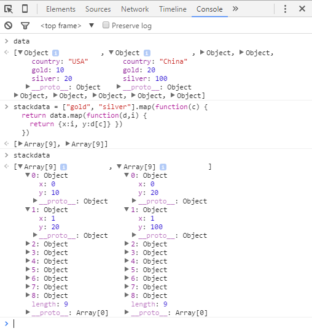

# Stack Layout

`d3.layout.stack()` takes two-dimensioanl data and generates stacked data.

```javascript
// data = [{country:"USA", gold:10, silver:20}, {country:"China", gold:20, silver:100}, ... ,]
// transform this data to
stackdata = ["gold", "silver"].map(function(c) {
  return data.map(function(d,i) {
    return {x:i, y:d[c]} })
  })
```

You can try this out in console



Now, on passing `stackeddata` to `d3.layout.stack()`.


In the stacked data, each object has been given a `y0` value. This is the baseline value.

# Draw Stacked Data

```javascript
// Create SVG
var svg = d3.select("body")
  .append("svg")
  .attr("width", 250)
  .attr("height", 250)
// Set up stack method
var stack = d3.layout.stack()
// Data, stacked
stack(stackdata)
// gold silver colors
var colors = ["gold", "silver"]
// Add a group for each row of data
var groups = svg.selectAll("g")
  .data(stackdata)
  .enter()
  .append("g")
  .style("fill", function(d, i) { return colors[i]})
// Add a rect for each data value
var rects = groups.selectAll("rect")
  .data(function(d) {return d})
  .enter()
  .append("rect")
  .attr("x", function(d, i) {return i*28})
  .attr("y", function(d) {return d.y0})
  .attr("height", function(d) {return d.y})
  .attr("width", 24)
```
<iframe src="../recipes/layout-stack.html" sandbox="allow-same-origin allow-scripts" onload="this.style.height=this.contentDocument.documentElement.scrollHeight+2+'px';"></iframe>

Adjust the Y positions

```javascript
.attr("y", function(d) {return d.y0})
// to
.attr("y", function(d) {return 250-(d.y0+d.y)})
```
<iframe src="../recipes/layout-stack-reverse.html" sandbox="allow-same-origin allow-scripts" onload="this.style.height=this.contentDocument.documentElement.scrollHeight+2+'px';"></iframe>
