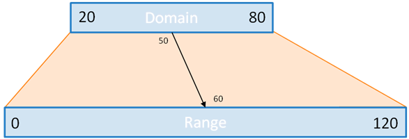

# Scales

So far, we have been representing data as is at pixel level. **Scales** are functions that map from an input domain to an output range, maps data to new values useful for visualization.



```javascript
var scale = d3.scale.linear()
              .domain([100, 900])
              .range([10, 75])

scale(100)  // returns 10
scale(900)  // returns 75
scale(500)  // returns 42.5
```

A looks at barchart with smaller values

```javascript
// instead of [120, 140, 150, 180]
var data = [12, 14, 15, 18]

var chart = d3.select('svg').selectAll('rect')
  .data(data).enter()
  .append('rect')
  .attr('x', 0)
  .attr('y', function(d,i) {return i * 30})
  .attr('width', function(d) {return d})
  .attr('height', 25)

d3.select('svg').selectAll("text")
  .data(data)
  .enter()
  .append("text")
  .text(function(d) {return d})
  .attr("y", function(d,i) {return i*30 + 20})
  .attr("x", function(d) {return d})
```
<iframe src="recipes/scales.html" sandbox="allow-same-origin allow-scripts" onload="this.style.height=this.contentDocument.documentElement.scrollHeight+2+'px';"></iframe>

```javascript
// instead of [120, 140, 150, 180]
var data = [12, 14, 15, 18]

var scale = d3.scale.linear()
              .domain([0, d3.max(data)])
              .range([0, 250])

var chart = d3.select('svg').selectAll('rect')
  .data(data).enter()
  .append('rect')
  .attr('x', 0)
  .attr('y', function(d,i) {return i * 30})
  .attr('width', function(d) {return scale(d)}) // scale
  .attr('height', 25)

d3.select('svg').selectAll("text")
  .data(data)
  .enter()
  .append("text")
  .text(function(d) {return d})
  .attr("y", function(d,i) {return i*30 + 20})
  .attr("x", function(d) {return scale(d)})     // scale
```
<iframe src="recipes/scales-bars.html" sandbox="allow-same-origin allow-scripts" onload="this.style.height=this.contentDocument.documentElement.scrollHeight+2+'px';"></iframe>

Use scales for colors too!

```javascript
var color = d3.scale.linear()
    .domain([d3.min(data), d3.max(data)])
    .range(["red", "green"])

chart.attr("fill", function(d) {return color(d)})
```
<iframe src="recipes/scales-bars-colors.html" sandbox="allow-same-origin allow-scripts" onload="this.style.height=this.contentDocument.documentElement.scrollHeight+2+'px';"></iframe>
