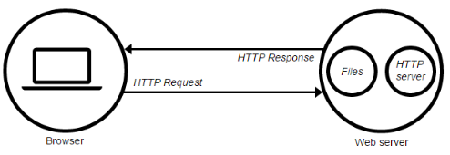
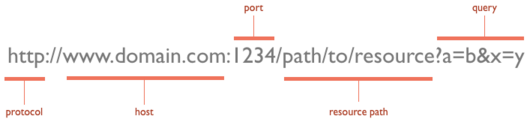

# Web Programming

This chapter contains a quick introduction to the various elements that make the web work.

## Clients and Servers


In a typical client/server *conversation* on Internet, the server contains files and HTTP server. And, the client (usually a web browser) requests the file from server via HTTP Request. When the request reaches the web server, the HTTP server (software) sends the requested file back, also through HTTP as response.

## URLs
Web-pages and other files that are accessible though the Internet are identified by URLs (*Universal Resource Locators*). A basic `URL` looks like this:


## HTML
The content and the structure of every web page is written in a language called HyperText Markup Language or HTML for short.

A basic `.html` file looks like this:

```html
<!DOCTYPE html>
<html>
  <head>
    <title>This is a title</title>
  </head>
  <body>
    <p>Hello world!</p>
  </body>
</html>
```

A more complete `.html` file would look like:

```html
<!DOCTYPE html>
<html>
  <head>
    <title>This is a title</title>
    <meta charset="utf-8">
    <script type="text/javascript" src="script.js"></script>
    <link rel="stylesheet" type="text/css" href="style.css">
  </head>
  <body>
    <p id="start">Hello world!</p>
    <div class="example">Let's explore!</div>
  </body>
</html>
```

`<!DOCTYPE html>` The standard document type declaration. The doctype declaration tells the browser that this page is written in HTML5.

`html` The html tag indicates that everything between <html> and </html> is code that conforms to the standards of the type of HTML dictated by the doctype declaration – in this case HTML5.

`head` contains all metadata about the document, such as its title and any references to external stylesheets (css) and scripts (js).

`title` of the document, typically displayed at the top of the browser window.

`body` tag contains the code that generates what is seen in a browser.

`p, div, span, a, h1 ul li , etc` are HTML elements that comprise the nodes of every document, which form a tree structure, called the Document Object Model (DOM) tree.

### Attributes
All HTML elements can be assigned attributes by including attribute/value pairs

```html
<tag attribute="value">content to be modified by the tag</tag>
```
### Classes and IDs
Classes and IDs are useful attributes, as they are used as selectors by CSS and JavaScript to identify elements.

## CSS
Visual representation and styling of a document's structure is taken by Cascading Style Sheets or CSS for short.

A basic `.css` file looks like this:

```css
body {
  margin: 10px;
  color: #fff;
}
h1 {
  text-align: center;
}
```

## JavaScript
While HTML defines a webpage's structure and content, CSS styles the appearance of document, JavaScript adds interactivity to webpages.

JavaScript is the scripting language of the Web, enabling us to make pages dynamic by manipulating the DOM after a page has already loaded in the browser.
